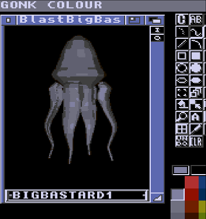
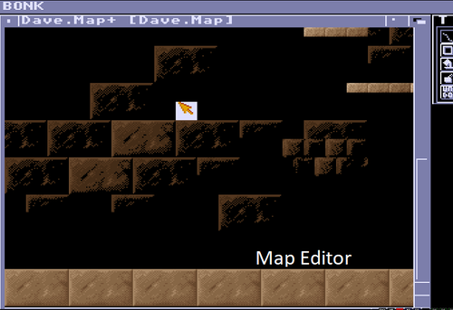
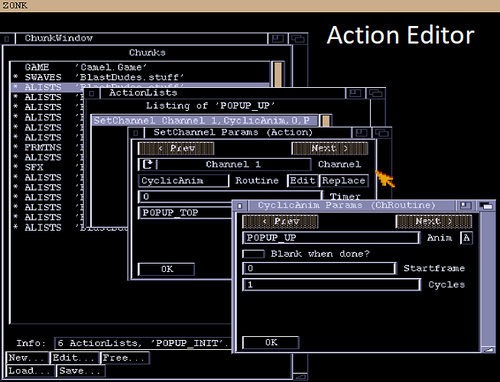
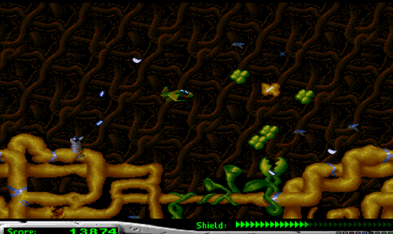

# Conk
Game Construction Kit for the Amiga

## [Official Website](https://theyoungones2.github.io/Conk/)

## Gonk
The sprite editor. Definitely not a Dpaint ripoff.

## Bonk
The map editor

## Zonk
The action editor

## Ponk
The game runtime

## Quickstart
I just want to play games. See [Quickstart](./docs/Quickstart.md)

## Full Dev Setup Instructions
See [Dev Setup Instructions](./docs/Readme.md)

