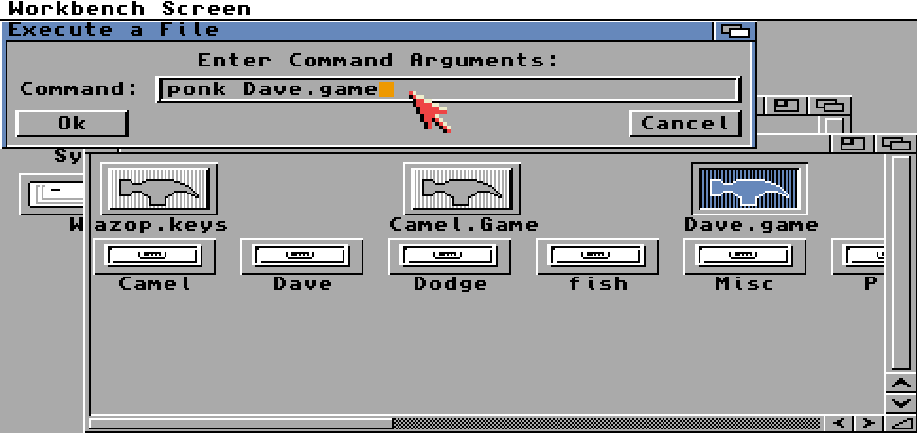

# Quickstart

Follow this if you just want to use Conk without the need for Dev Tools.

1. [WinUAE Setup](./Setup/1.WinUAE-Setup.md)
2. [Workbench Setup](./Setup/2.Workbench-Setup.md) - Stop after Display Section

From Workbench, open the "Work" disk.  
Right-click Menu > Window > New Drawer > Dev > OK  
Open the Dev Folder.  
Right-click Menu > Window > Show > All Files  
Right-click Menu > Window > Snapshot > All  

From Windows, copy this repo into C:\Amiga\Dev\

`ed s:User-Startup` - Add the following
```
;BEGIN Conk
assign ck: Work:Dev/Conk
path ck:Ponk add
;END Conk
```
Save and Quit  
Reset (Insert + Home + Ctrl)

Then in Workbench you can double click the *.game files, and add "ponk" to the start of it.


or Right-click Menu > Workbench > Execute Command > NewShell > Ok  

```
> cd Work:Dev/Conk/ConkDemo
> ponk Camel.game
```

Hit Esc to quit.

There's several `*.game` files in the subfolders also.
