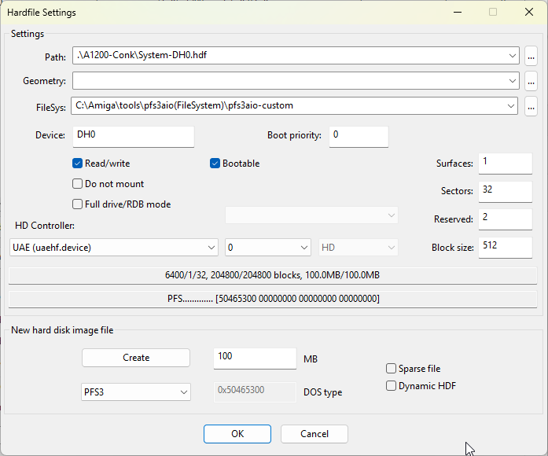
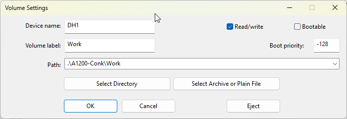

# WinUAE Setup

The instruction below will setup the following:
- System: A1200
- Kickstart 1.3
- Workbench 3.1
- DH0: 100M HDF (pfs3aio Hardfile)
- DH1: “Work” Directory

Create a folder for your Amiga Setup. I'm using "C:\Amiga\". Change paths as appropriate.

Download and install [WinUAE](https://www.winuae.net/download/) zip-archive (64-bit). Extract and copy winuae64.exe into C:\Amiga\

From [Amiga Forever](https://www.amigaforever.com/) buy the "Plus Edition". This gives you the Kicktart and Workbench Disks.
Install the package.
Open Start > Amiga Forever > Amiga Files. This contains the Kickstart ROMs and Workbench install disks (adf - Amiga Disk File).

Optional - Copy ROMs and Workbench to C:\Amiga\ for convenience.
- Make directory C:\Amiga\AmigaForever
- Copy "Amiga Files" to C:\Amiga\AmigaForever\

Download [Professional File System III (PFS3)](https://aminet.net/package/disk/misc/pfs3aio). Download "disk/misc/pfs3aio.lha". Extract with 7-Zip and copy into C:\Amiga\tools\.  
This will be used for the System (DH0) Drive.

  
Why Professional File System III (PFS3)

  Using Professional File System III (pfs3aio) for your WinUAE hard drive setup is widely considered the "gold standard" for several reasons: 
  - Superior Speed: It is significantly faster than the standard Amiga Fast File System (FFS), especially during directory listings and file operations.
  - Created by Toni Wilen, the creator of WinUAE.
  - Extreme Robustness: Unlike FFS, which can enter a slow "Validating" state after a crash or improper shutdown, PFS3 is much more stable and resistant to corruption. If a crash occurs, it does not typically trash the drive.
  - Large Drive Support: It overcomes the 4GB limit of older Amiga systems. With pfs3aio, you can use partitions up to 104 GB (and experimentally larger).
  - Universal Compatibility: The "aio" (All-In-One) version automatically detects the best access mode for your setup, including Direct SCSI, TD64, and NSD, making it compatible with almost any hardware or emulator configuration.
  - Modern Features: It supports long filenames (up to 107 characters) and is more efficient on system resources than competing filesystems like SFS (Smart File System), which often lacks reliable repair tools

  See also https://en.wikipedia.org/wiki/Professional_File_System

### WinUAE Configration
Create directories:
- C:\Amiga\A1200-Conk
- C:\Amiga\A1200-Conk\Work

Open C:\Amiga\WinUAE.exe

Paths
- System ROMs: .\AmigaForever\Amiga Files\Shared\rom\
- To the right of "Set Path" Select "WinUAE default (EXE directory)
- "Use relative paths" & "Portable mode" should both be ticked
All other settings default.

Quickstart
- Model: A1200
- Configuration: 4MB Fast RAM expanded configuration
Hardware
- CPU and FPU
  - CPU: 68040
  - JIT
  - MMU: None
  - FPU: CPU Internal
  - CPU Emulation Speed: Fastest Possible
  - Advanced JIT Settings
    - Cache Size: 16 MB
    - Constant jump
    - No flags
    - Direct
    - Catch unexpected exceptions
  - 
- ROM
  - Main ROM file: KS ROM 3.1 (A1200)
- RAM
  - Chip: 2 MB
  - Z2 Fast: 4MB
- CD & Hard drives
  - Add Hardfile... (Create System DH0:)
    - New hard disk image file
    - 100 MB
    - PFS3 DOS type
    - Select Create
    - c:\Amiga\A1200-Conk\System-DH0.hdf
    - Save
    - FileSys: C:\Amiga\tools\pfs3aio-custom
    - Device: DH0
    - 
  - Add Directory or Archive... (Create Work DH1:)
    - Device name: DH1
    - Volume label: Work
    - Path: .\A1200-Conk\Work
    - Uncheck Bootable
    - OK
    - 
Configuration
- Name: A1200 Conk.uae
- Save

## Additional Help
A lot of this is taken from Amiga WinUAE Guide by MikeyGRetro
https://www.youtube.com/watch?v=jJG8-KG9tLI&list=PLfl5qkIeWkBnxwbuGcp7uQVoL8v3-EhDP&index=1

Tips:
Restart Amiga: Ctrl + Amiga + Amiga (Ctrl + Insert + Home)
