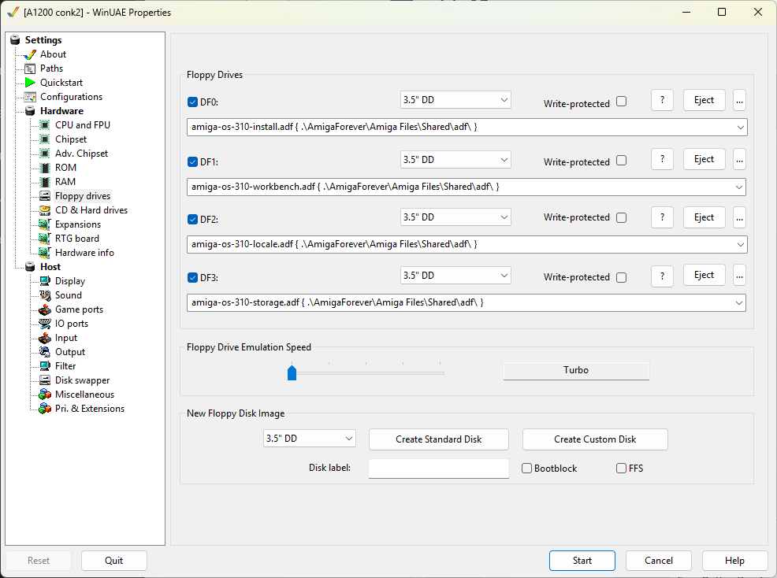
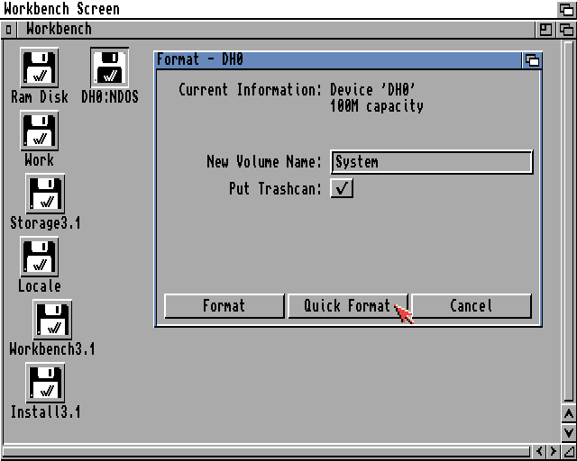
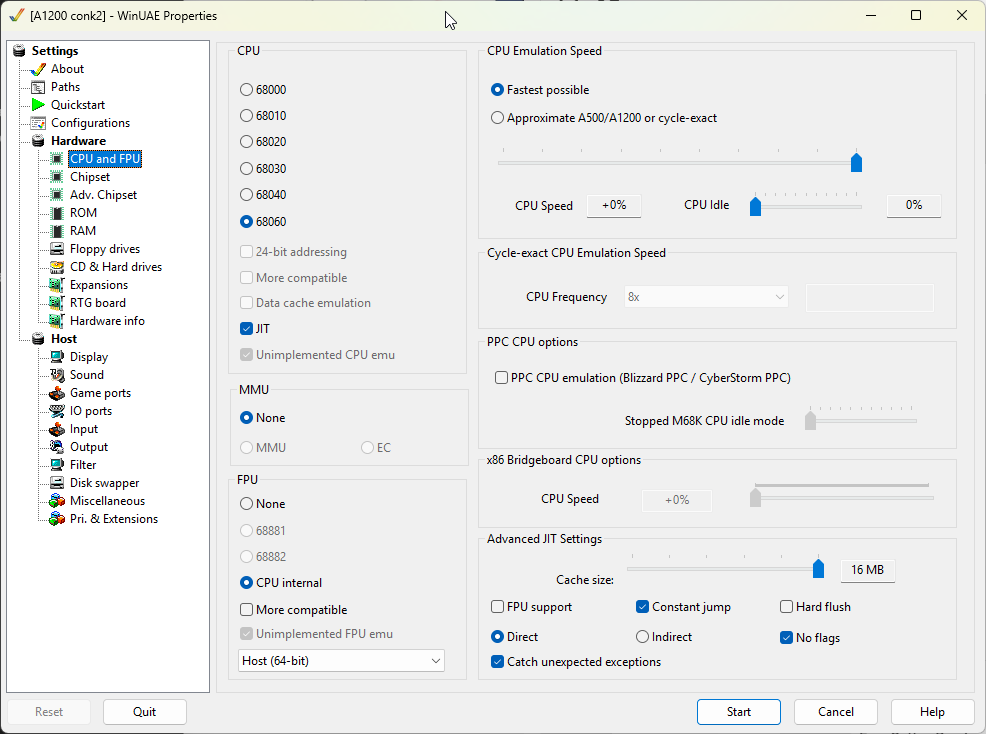

# Workbench Setup

This will install Workbench 3.1, the last official that Conk was built on.

From WinUAE

Hardware
- Floppy Drives
  - DF0: amiga-os-310-install.adf { .\AmigaForever\Amiga Files\Shared\adf\ }
  - DF1: amiga-os-310-workbench.adf { .\AmigaForever\Amiga Files\Shared\adf\ }
  - DF2: amiga-os-310-locale.adf { .\AmigaForever\Amiga Files\Shared\adf\ }
  - DF3: amiga-os-310-storage.adf { .\AmigaForever\Amiga Files\Shared\adf\ }
  - Floppy Drive Emulation Speed: Move all the way to the left (Turbo)
  - 
- Start

This will boot to Workbench.  

### Format DH0 (System)
- Select DH0:NDOS
- Right-Click > Icons > Format Disk...
- New Volume Name: System
- Quick Format
- 
- Select Format & Format again on the confirmation boxes
- OK on the PFS confirmation box

### Install Workbench 3.1
- Open Install3.1:Install/English
- Proceed
- Install Release 3.1
- Select Intermediate User
- Proceed With Install
- Install Options: Proceed
- Do you want Release 3.1 isntall in the "System:" partition? - Yes
- English - Proceed
- Printers - Proceed
- Keymap - American

When prompted for "Amiga Extras"
- Press F12 to open WinUAE
- Change Floppy Disks
  - DF1: amiga-os-310-extras.adf { .\AmigaForever\Amiga Files\Shared\adf\ }
  - DF2: amiga-os-310-fonts.adf { .\AmigaForever\Amiga Files\Shared\adf\ }
- OK
- Install should continue
- When install complete
  - Press F12 to open WinUAE
  - Eject all floppy disks
  - OK
- Proceed to reboot

It should now reboot into Workbench from the DH0

### Boost CPU
We can now boost the CPU
- F12 to open WinUAE
- CPU and FPU
  - CPU: 68040
  - JIT
  - MMU: None
  - FPU: CPU Internal
  - CPU Emulation Speed: Fastest Possible
  - Advanced JIT Settings
    - Cache Size: 16 MB
    - Constant jump
    - No flags
    - Direct
    - Catch unexpected exceptions
  - 
- Configurations
  - Save
- Reset

### Display

Right-click Workbench
- Workbench Menu > Select Backdrop
- Window Menu > Snapshot > All

System > Prefs > Screen Mode
- PAL: High Res Laced
- 32 Colors

WinUAE > Host > Display
- Windowed 1280 x 1024 (If you're running 1440p or above)

Correct Work: Icon
- System:Tools/IconEdit
- Drag in System Icon
- Save As Work:disk.info

### Click to Front

System > Tools > Commodities
- Select ClickToFront
- Icons Menu > Copy
- Drag Copy_of_ClickToFront to System:WBStartup
- Icons Menu > Rename > ClickToFront
- Icons Menu > Information
- Change QUALIFIER=LEFT_ALT to QUALIFIER=NONE > SAVE
- Reboot (Insert + Home + Ctrl)
- You can now double-click a window to bring to the front.

### CygnusEd (CED) Install
- Open Work Drive > Windows Menu > New Drawer > "Tools" > OK
- https://archive.org/download/CommodoreAmigaApplicationsADF
- Download
  - CygnusEd Professional v4.2 (1997)CygnusEd Professional v4.2 (1997)(ASDG)[WB].zip
  - Installer v43.3 (1996)(Amiga International).zip
- Extract both Zip files
- Install Installer
  - Mount Installer adf into DF0:
  - Workbench Menu > Execute Command > NewShell
  - `copy df0:installer c:`
- Install CygnusEd (CED)
  - Mount CygnusEd adf into DF0:
    - Open Disk > Install_CygnusEd
    - Intermediate User > Proceed
    - Proceed
    - Select Work:Tools > Proceed
    - No - existing installation
    - No - special verson
    - Proceed (finish install)
  - Eject DF0
  - Replace "ed" with "ced"
    - Workbench Menu > Execute Command
    - ced S:User-Startup
    - Add `alias ed Work:Tools/CygnusEd/Ed` to the CygnusEd section
  - Reset (Insert + Home + Ctrl)
  - Executing "ed" should now start "ced"

### WShell (NewWSH) Install

> [!NOTE]
> Not working yet. To be sorted later.

WShell Install
Copy WShell-Install folder to RAM:
New NewShell
cd RAM:WShell-Install
execute install-wshell
You can open NewWsh to open WShell
ed s:WShell-Startup
prompt “%c> “
