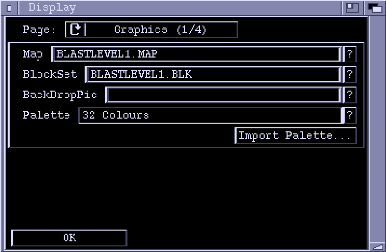
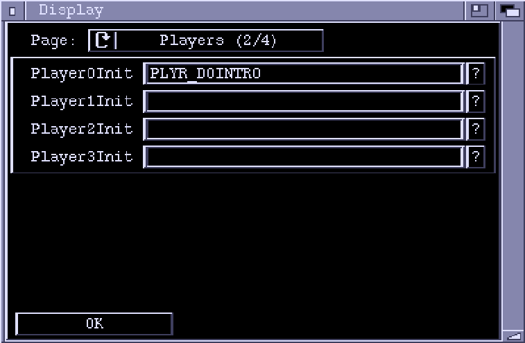
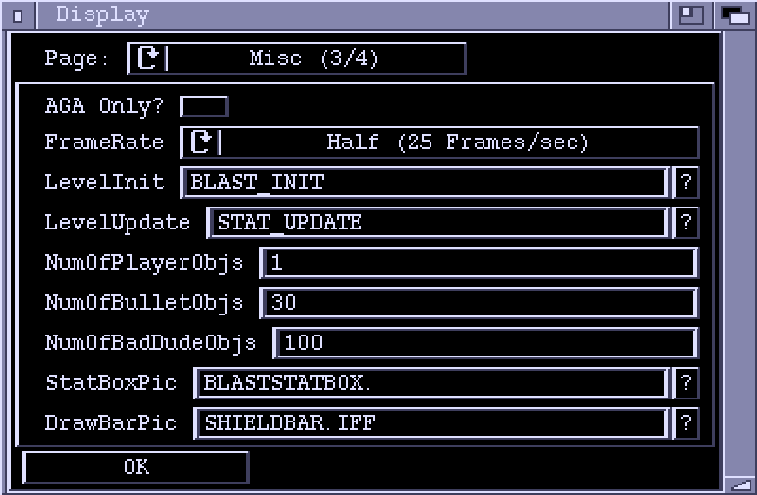
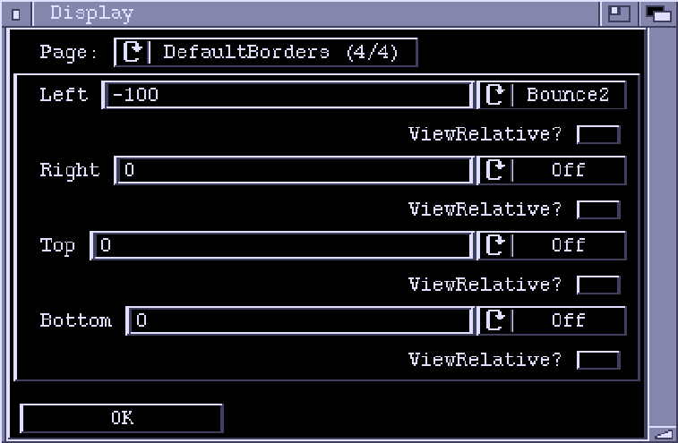

# DisplayChunk Window

**Page**  
Cycles through the various pages of editable data in the Display Chunk.

## Graphics Page

**Map**  
The name of the background Map to be used in the level. If you do not want
a Map in the background then leave this field blank. The question mark brings
up a list of currently loaded Maps.

**BlockSet**  
The Blockset used by the Map, if any.

**BackDropPic**  
An picture (IFF ILBM) to use in the level background instead of a Map.
The first 13 letters of the pictures file name is entered here, without the
directory path. The question mark gadget lets you select a picture using
a file requester.

**Palette**  
The Palette used by the level is stored in the display chunk. You can copy
the palette from one already loaded into Zonk using the question mark, or
you can import one from disk using the "Import Palette..." button.
"Import Palette..." can extract palettes from IFF ILBMs and Conk files.

## Players Page

**Player0Init, Player1Init, Player2Init, Player3Init**  
These four fields hold the ActionLists used to initalize any Player objects
at the start of the level. Any (or all) of these fields may be left blank.  
Any ActionLists specified here execute on the context of the player they
are initializing.  
Select "?" to select an ActionLists from the
ones currently loaded into Zonk.

## Misc Page

**AGA only?**  
If this checkmark is set, then Ponk will stop the level from running on
a non-AGA machine.

**Frame Rate**  
The speed at which the game runs. At full frame rate, the game will try to
update with every retrace of the raster. At half frame rate it will update
every second retrace. If a lot of things are happening in the level, then
the computer may not be fast enough to keep up with the specified rate.
Half frame rate gives the processor twice as much time to get a frame ready
for display than full frame rate does.

**Game Init**  
ActionList executed at the start of the level. Usually used to set up
scrolling and assorted global data. This ActionList executes in a global
context, and cannot contain any actions which require access to an object.
This field may be left blank.

**Game Update**  
An ActionList that is executed every frame. It can, for example, be used
to update items in the StatBox. Again, this ActionList executes in a global
context.

**NumberOfPlayerObjs**  
The number of player objects that are allocated at the beginning of the
level. If Ponk runs out of objects during gameplay it will allocate
more, but allocating objects on the fly is inefficient and generally
considered a Bad Thing. Incidentally, you can have more than four player
objects, but usually you wouldn't really want to.

**NumberOfBulletObjs**  
The number of PlayerBullet objects allocated in advance.

**NumberOfBadDudeObjs**  
The number of BadDude objects allocated in advance.

**StatBoxPic**
The Picture (again an IFF ILBM) to use as the StatBox. The palette for
the StatBox is taken from the ILBM. Only the first 13 characters of the
filename is entered, without the path.

## Default Borders Page

This page lets you set up the default borders for the level. All objects in the
level are initially created with the border values specified here. The borders
can be set on a per-object basis using the 'SetBorders' action.
