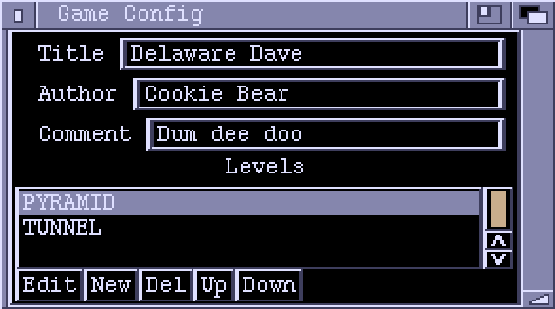
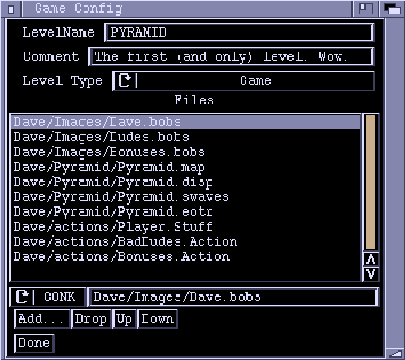

# Game Chunk Type

## Game Config Window

**Title, Author, Comment**  
Info on your game - fill in how you like.

**Levels**  
A list of the levels making up the game.

**Edit** 
Edit the highlighted level. This brings up the level config page.

**New**  
Adds a new level.

**Del**  
Deletes the highlighted level.

**Up, Down**
Moves the highlighted level up or down a place in the list.

## Level config page

**Level Name**  
The name to use to identify the level.

**Comment**  
For you to use how you like.

**Level Type**  
- **Game** is a standard Conk level which uses a Display chunk and
ActionLists (ie a level you've made up with Zonk).
- **Anim** play an IFF animation, then the next level is called.
- **Pic** levels have not been programmed yet, but will be for displaying still
pictures. Ponk always starts the game on the first level in the list.

**Files**  
This is a list of all the files to load in for this level. The directory
path for each file is relative to the directory in which you are going to
run Ponk.  
The string gadget underneath lets you edit the names directly. The cycle gadget
indicates the type of file
- **CONK** - Files created in Conk. *.game, *.action, *.bobs, *.disp, *.sfx
- **ILBM** - IFF ILBM (Interchange File Format - Interleaved Bitmap) the standard image file. *.iff file
- **ANIM** - An IFF ANIMation. *.anim file
- **MOD** - Tracker Module. *.mod
- **????** - unknown

This lets Ponk know what type of file it is dealing with.

**Add...**  
Brings up a file requester to let you pick files. To select multiple files,
hold down the shift key while using the requester. Zonk will try and guess
the file type(s).

**Drop**  
Drops the currently highlighted file from the list.

**Up, Down**  
Move files up and down the list. The order of files is not important.

**Done**  
Exits back out to the Game config page.
