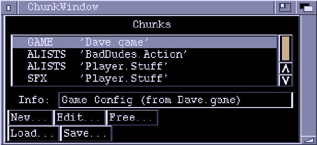

# ZONK

## Chunk Window

The Chunk window is the heart of Zonk. It controls the loading and saving
of chunks and launches appropriate editors for chunk editing.
You can close the Chunk window (Zonk won't exit until all windows are closed),
but it's usually handy to have it about.

The gadgets in the Chunk Window are:

**Chunks**  
A list of the currently-loaded chunks. Marked chunks are preceded with an
asterisk ('*'). If you double-click on an unmarked chunk, it will be marked,
along with any other chunks from the same file. Double-clicking on a marked
chunk removes the mark. A plus sign ('+') immediately preceeding a chunk
means that that chunk contains unsaved changes.

**Info**  
Displays information about the currently highlighted chunk, if any.

**New...**  
Creates a new chunk. A requester appears to ask you which type of chunk you
want created.

**Edit...**  
Lets you edit the currently highlighted chunk. Not all chunk types may be
edited in Zonk.

**Free...**  
Discards the highlighted chunk.

**Load...**  
Loads from a file.

**Save...**  
Save the marked chunks together in a file.

## Types of Chunks
- [GAME](./game.md) - Game and Level configuration
- [ALISTS](./actionlists.md) - ActionLists, the brains of how things move and collide
- [DISPLAY](./display.md) - Define Map, Palette, Player, Framerate etc
- [WEAPONS](./weapons.md) - Weapon actions, number of bullets, power ups etc.
- [PATHS](./paths.md) - TBA?
- [SWAVES](./scrollwaves.md) - Setup map triggers to start bad dudes
- [FRMTNS](./formation.md) - Formations
- [TWAVES](./timedattackwaves.md) - Times Attackwaves
- [SFX](./soundfx.md) - Sound Effects
- [EOTR](./eotr.md) - Edge Of The Road, block collision information

## Menus

### PROJECT MENU

**New Chunk...**  
Creates a new chunk. A requester appears to let you select the chunk type.

**Load Chunk(s)...**  
Load one or more files using a file requester. Hold down the SHIFT key while
selecting to load multiple files.

**About...**  
Bring up the 'About' window.

**Quit...**  
Kill Zonk. You will be informed of any unsaved work.

### WINDOW MENU

**Open/Chunk...**  
Opens the Chunk window. If the Chunk window is already open, it is moved
to the front and activated.

**Open/Screen Settings...**  
Opens the Screen Settings window. If it is already open, it is brought to
the front and activated.

**Open/About...**  
Opens the About window.

**Close**  
Tries to close the currently active window. Same as clicking on the window
close gadget.

### SETTINGS MENU

**Save Icons?**  
This option has no effect at the moment.

**Make Backups?**  
If this is set, files will be copied to ".bak" files before they are
overwritten. For example, if you open a file "Wibble.stuff", make some
changes and then save it, the old version will be kept as "Wibble.stuff.bak".
It is recommended that you leave this option enabled.

**Screen Settings...**  
Brings up the Screen Settings window. If the window is already open, it
will be moved in front of all the other windows and activated.
See [Screen Settings](./menu-settings-screen-settings.md).

**Load Settings...**  
Loads settings from a file and uses them. Settings are actually saved as
ZONKCFG chunks. You can load one of these into the Chunk window and click the
"Edit" button to install it. But if you'd actually want to do that is a
different matter.

**Save Settings**  
Saves the current settings as the default configuration ("Zonk.cfg").

**Save Settings As...**  
Saves the current settings into a specified file.
