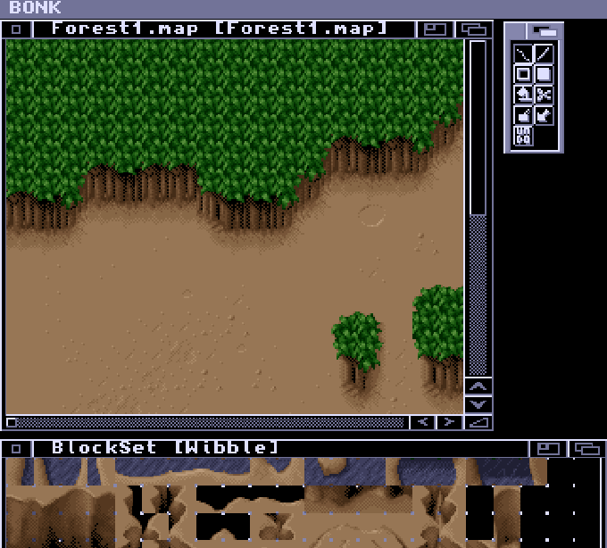
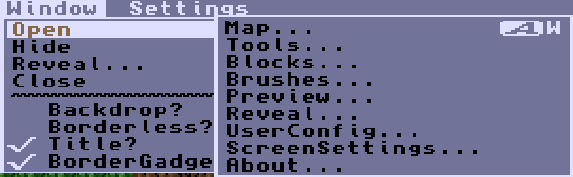
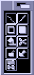
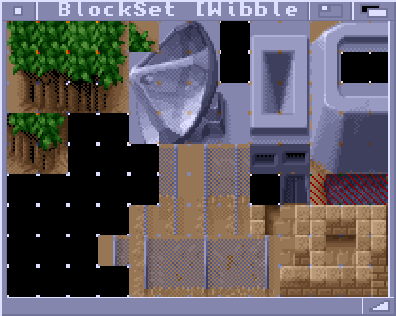
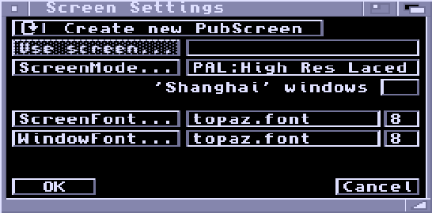
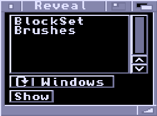
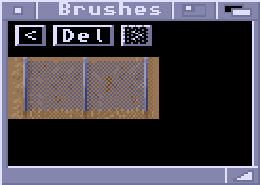
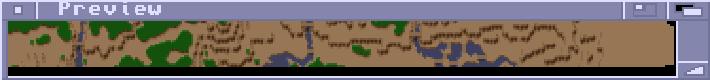

# BONK - The Map Editor

## Opening Windows

With any window selected, you can open more windows from the menu Window > Open > ...  
You will normally want Maps, Tools, and Blocks open.

## Map Window

Map editing is performed in the Map window. A section of map is displayed,
which you can scroll using the scroll gadgets in the border or the cursor
keys.  
- The cursor keys move the map one block in a given
direction.
- Holding ALT lets you move along four blocks at a time.
- Holding SHIFT jumps a page at a time.
- Holding CTRL moves the display to the extreme edge of the map.

A Map can have multiple windows viewing it - any changes you make in one
window will be reflected in all other windows. You can have multiple maps
loaded, but they will all share the same blockset and palette (you can only
have one Blockset and one palette loaded at once). You can cycle through the
Map windows by pressing 'j'.

Editing is done with the mouse. Each mouse button (including the third
button if you have one) can be assigned a block from the blockset. You can use
any mouse button to draw using the currently selected tool. The right mouse
button is considered to be the erase button.

The title bar of the Map window displays the name of the file the Blockset
came from, followed by a '+' if the map has unsaved changes, and then the
name of the Map in square brackets. The Map name is embedded inside the Map
chunk and used as a reference during a game.

Because the right mouse button is used for drawing, you have to move outside
the Map window in order to use menus.

## Tools Window

Tools are selected by clicking on their button in the Tools window. When you
select a tool, the previously active Map window (if any) is reactivated
automatically.

**Drawing**  
A standard drawing tool: hold a mouse button down and draw. The keyboard
shortcut for this tool is '.' (the fullstop).

**Line**  
Press a mouse button down at the start of the line, move to the end of the
line and release. Keyboard shortcut 'l'.

**Rectangle**  
Press a mouse button down at one corner and drag out. Keyboard shortcut 'r'.

**Filled Rectangle**  
Same as rectangle, only interior is filled in.

**Flood Fill**  
Click at 'seed' point. The fill moves outward until it hits blocks different
to the one originally at the starting point. Keyboard shortcut 'f'.

**Cut**  
Lets you pick up a rectangular area of map as a brush. Keyboard shortcut 'b'.

**Paste**  
Pastes the current brush down on the map. The block value currently assigned
to the right mouse button is considered transparent in the paste operation.

**Pick**  
Click a mouse button on a block on the map to assign that block value to the
button.

**Undo**  
Not an actual selectable tool, this button undoes the last operation.
Keyboard shortcut 'u'.

## Blocks Window

The currently loaded blockset is displayed in the Blocks window. You can
assign a block to a mouse button by clicking on it (this works for all mouse
buttons). If you hold the mouse button down you can drag out a rectangular
area of blocks and pick them up as a brush. If the blocks do not all fit in
the window at once, you can scroll around with the cursor keys.

Pressing the space bar in a Map window will send it to the back and bring
up the Blocks window. Pressing space or selecting a block (or brush) in the
Blocks window sends it to the back and reactivates the previous Map window.
The upshot is that the Blocks window acts as a pop up block selector.

The title bar of the Blocks window displays the name of the Blockset in
square Brackets. This is not a filename - it is the name embedded in the
Blockset chunk and used to reference the Blockset during a game.

Like the Map window, you have to move outside the Blocks window in order
to use the menus.

## Screen Settings Window

This window lets you tell Bonk which screen to open on, which screenmodes and
fonts to use and that sort of thing. The changes you make in this window do
not take effect until you click "OK".

**Create New PubScreen/Use Existing PubScreen**  
This cycle gadget determines whether Bonk opens up on its own screen or
borrows another screen.

**Use Screen...**  
The name of the public screen to open on.

**ScreenMode...**  
If Bonk is to open its own screen, the screen mode is selected here.

**'Shanghai' windows**  
If this checkbox is set, Bonk will 'Shanghai' windows that would have opened
on workbench and divert them to its own screen.

**ScreenFont**  
This is the default font of the Bonk screen. It will appear in the screen
and window title bars.

**WindowFont**  
This is the font to use in Bonk windows.

## Reveal Window

The Reveal window lists hidden windows. A window can be hidden using the Window Menu > Hide.  
The cycle gadget lets you view by window or by Map (a Map may have multiple windows). Just select the window
or Map you want to redisplay and click "Show".

## Brushes Window

The brushes window lets you see a history of the last ten brushes. The
displayed brush is the one used by the "Paste" tool. You can use the "<" and
">" buttons to move through the brushes. "Del" deletes the current brush.

## Preview Window

Displays an overview of a Map. Each pixel corresponds to one block. Before
opening a preview window, you must first select a Map window displaying the
Map you want to view. When a preview window is opened, there is a delay while
it figures out good colours to represent each block. This calculation also has
to be done if a new blockset or palette (or both) is loaded.
