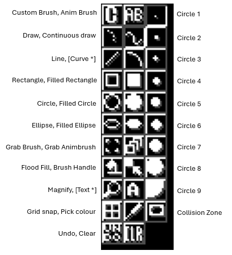

Tools Window
------------

The tools buttons are arranged in three columns:

Left Column, from top to bottom:

- Custom Brush: Tells Gonk to use the current custom brush (if any) for
drawing.
- Draw: Standard drawing tool. Draw with left mouse button, erase with right.
- Line: Straight line tool.
- Rectangle: Draws an unfilled rectangle.
- Circle: Unfilled circle.
- Ellipse: Unfilled ellipse.
- Grab brush: Pick a rectangular area of picture up to use as a custom brush.
- FloodFill: Flood fills an enclosed area.
- Magnify: Toggles magnify mode on/off. Use 'I' and 'O' gadgets in right
border of main editing window to zoom in or out.
- Grid on/off: Toggles the grid on or off. When grid is on, drawing
operations allign themselves to the nearest eight-pixel boundary.
- Undo: Undoes the last operation (note: there is no way to undo an undo).

Middle Column (top to bottom):

- Animbrush: Use the current animbrush (if any) for drawing.
- Continuous draw: Same as 'Draw' except the points are joined up.
- Curve: Not implemented.
- Filled rectangle
- Filled circle
- Filled ellipse
- Pick up animbrush: Lets you pick up an area of picture over a number of
frames to use as an animbrush. Only works for bob or sprite type projects.
- Brush Handle: Allows you to reposition the handle on the current brush.
- Text: Not implemented.
- Pick Colour: Pick a colour from the picture. The colour can be picked
using any mouse button.
- Clear: Clears the picture.

Right Column

The first nine buttons in this column allow you to select the in-built
circle brushes of various sizes. The last button selects collision zone
editing mode for bobs and sprites (only it doesn't seem to work very
well at the moment)...

