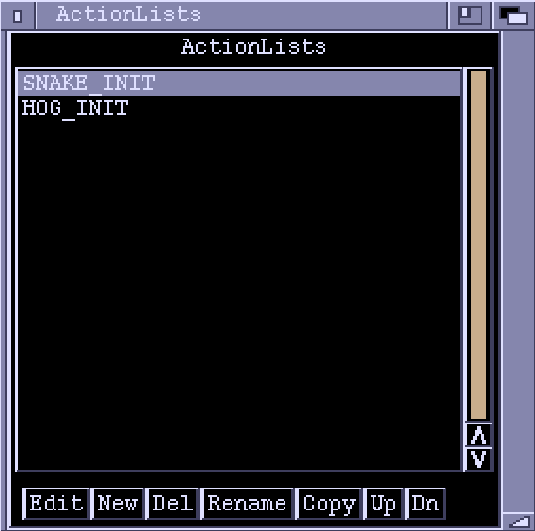
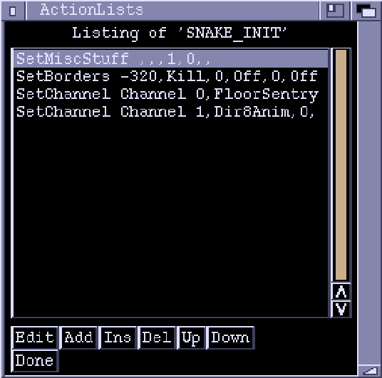

# ActionLists Window

!!! note

    See **[Actions](./actions.md)** for a complete list of Actions.

## ActionLists

The ActionLists window starts off displaying a list of all the ActionLists in
the chunk.

**ActionLists**  
A List of the ActionLists in the chunk. 
Double-clicking an ActionList has the same effect as highlighting it and
then clicking the "Edit" gadget.

**Edit**  
Switches to editing mode for the highlighted ActionList. See below.

**New**  
Creates a new, empty, ActionList. You are prompted for a name.

**Del**  
Deletes the highlighted ActionList.

**Rename**  
Renames the highlighted ActionList.

**Copy**
Creates a new ActionList, copying the contents from another.

**Up**  
Moves the highlighted ActionList one position up. A purely cosmetic option
as the order is unimportant.

**Dn**
Moves the highlighted ActionList one position down.

## Editing Mode

In editing mode the window layout changes:

**Listing of...**  
A list of the Actions in the ActionList.

**Edit**  
Brings up another window to edit the parameters of the highlighted action.
The parameter-editing windows contents depend on the particular action. If an
action has a lot of parameters, they will occupy more than one 'page'. You
can flick between the pages using the `Next >` and `< Prev` buttons. When the
parameters have been set to the values you want, click "OK". The window close
gadget has the same effect.

**Add**  
Add another action at the end of the ActionList. A requester will come up
prompting you to select an action. The left part of the requester lists
various categories of actions, while the right part lists the actions in the
selected category. The "All" category lists every action.

**Ins**  
Inserts an action before the highlighted one. Again, a requester will appear
to let you select the action.

**Del**  
Deletes the highlighted action.

**Up**  
Moves an action one position up the list. Order can sometimes be important
(in the game, the actions will be executed from top to bottom).

**Down**  
Moves an action one position down.

**Done**  
Exits editing mode and returns to the list of ActionLists. The close gadget
of the window has the same effect.
