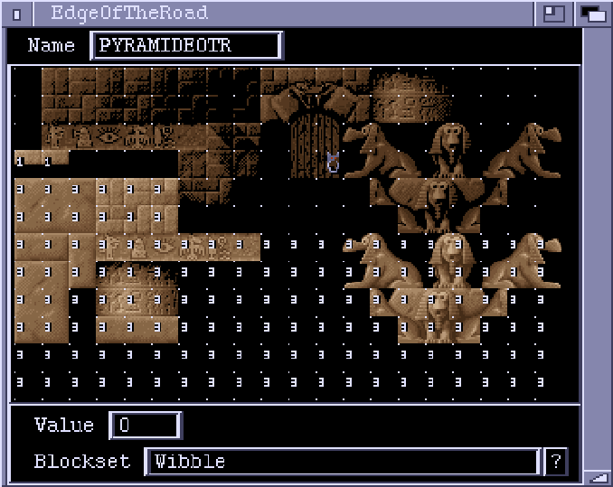

# EdgeOfTheRoad Window

This editor window lets you make up EdgeOfTheRoad data to go with a blockset.
Each block is assigned a number. This number is used by some Actions and
ChannelRoutines to determine the type of a particular block. The meaning of
given to the numbers depend entirely on the Action/ChannelRoutine. For example,
the 'BGCollision' ChannelRoutine has a parameter called 'HighestSpaceVal'.
Any blocks with EOTR values above this are regarded as solid wall. EOTR values
equal or below are regarded as free space.  
The blockset is displayed in the window, and the EOTR numbers are overlaid,
except for zeros. Clicking on a block assigns it the current value (in the
"Value" gadget).

**Name**  
The name of this EOTR data. This is the name that is referenced by Actions
and ChannelRoutines.

**Value**  
The current value. Use the mouse to assign this value to particular blocks.

**Blockset**  
The blockset that this EOTR data is for. You need to have a loaded Blockset
before you can do any EOTR editing. The "?" button lets you browse through
the loaded Blocksets.
