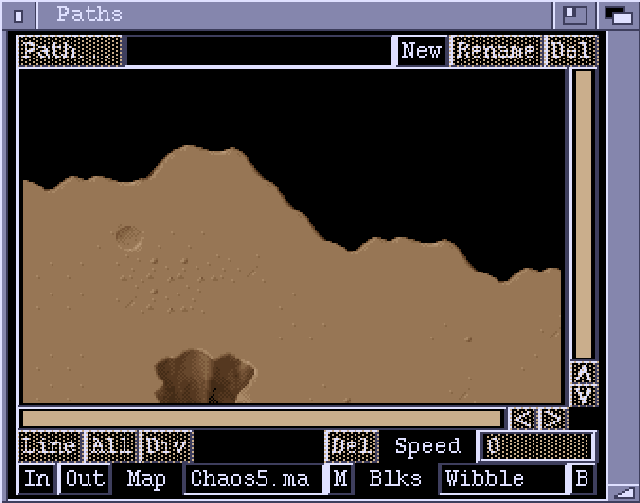

## Paths Window

**Path**  
This button brings up a requester to let you select a path to edit.

**New**  
Creates a new path.

**Rename**  
Renames the current path.

**Del**  
Delete the current path.

The middle area of the window displays the path currently being edited. The
path consists of points connected by line segments. Points are represented by
small squares. The start point of the path is marked by an X. Points can be
dragged around using the mouse. A line segment can be selected by clicking on
it. Holding down the SHIFT key lets you select multiple line segments. Selected
line segments appear in a different colour to unselected ones. Each line
segment has an associated speed value. This is the speed, in pixels per frame,
at which an object will travel along the segment.

**Line**  
Adds a line segment to the path. The length and speed of the new segment will
be copied from the previous segment.

**All**  
Selects all the line segments in the path.

**Div**  
Subdivides the selected line segments. Each line segment is split in half,
with a new point being placed at the midpoint.

**Del**  
Deletes the selected line segments.

**Speed**  
This number gadget displays the speed value of the most recently selected
line segment. Entering a new value sets the speed of all the currently
selected segments.

**In**  
Zoom in.

**Out**  
Zoom out.

**Map**  
Picks a Map (from a loaded chunk) to use as a background for the path.
This lets you position paths at a specific position on the map, and align
with features on the map.

**Blks**  
Picks a blockset to use with the background Map.
