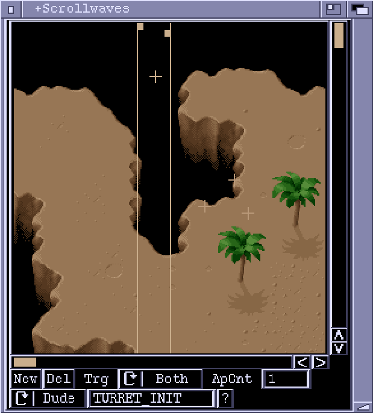

# ScrollWaves Window

This editor window lets you set up events that occur when the scroll view hits
certain trigger points on the background map. An event can create a bad dude,
execute an ActionList or start a Formation. Each event has a left trigger
point or a right trigger point or both. These are x (horizontal) positions
along the background map. The left point triggers the event when it is hit by
the right edge of the screen. The right point triggers when it is hit by the
left edge of the screen.

In the ScrollWaves window, events are represented by a crosshair or a bob
image (for bad dudes, if the image is in a loaded chunk). Events can be
selected and dragged to new positions using the mouse. The trigger point(s) of
the selected event are displayed as vertical lines, with tabs at the top for
repositioning.
	You can scroll around the map using the cursor keys. Hold down ALT,
SHIFT or CTRL to scroll around in larger increments.

**New**  
Creates a new event. The event will be positioned in the middle of the
editor view.

**Del**  
Delete the selected event.

**Trg**  
Selects which trigger points are active.

**ApCnt**  
The number of times the event can be triggered. A Zero in this field means
that the event will be triggered every time one of the trigger points is hit.

**ALst/Dude/Fmtn**  
The cycle gadget determines the nature of the event. The options are 'ALst',
'Dude' or 'Fmtn'. If set to 'ALst' the event will execute the ActionList 
specified in the string gadget. It will be executed on a global context,
and the position of the event crosshair is not used. For 'Dude' events, a
new BadDude object will be created and the ActionList in the string
gadget will executed upon it. The ScrollWaves editor will look for a bob
image to use for displaying the dude by searching through the ActionList.
If a reference to an image (or anim) is found, the loaded bob chunks are
searched and if possible the image is displayed. 'Fmtn' events start a
Formation, specified in the string gadget. The '?' button lets you browse
through loaded ActionLists or Formations using a requester.

NOTE: At the moment, ActionList type events are not available for ScrollWaves.
