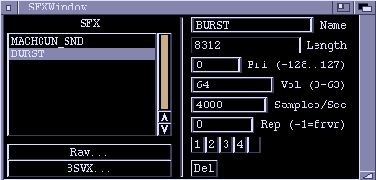

# Sound Effects Window

Before Conk games can use sound effects they must be put into a SFX chunk.
This editor window lets you import raw and IFF 8SVX sample data, and has
minimal effect twiddling capabilities.

**SFX**  
This is a list of the sound effects in the chunk. Highlight by clicking.

**Raw...**  
Import raw sample data from a file. Raw data has no additional information
with it so Zonk just fills the various parameters with arbitrary values.

**8SVX...**  
Import an (uncompressed) IFF 8SVX file.

**Name**  
The name used to reference the sound effect.

**Length**  
The length of the sample data, in bytes.

**Pri**  
Priority of the effect. If you try to play a sound effect on a channel
which is already playing, the new effect will only be played if it has a
higher priority.

**Vol**  
Volume to play the sample at. 0 is quietest (off), 63 is loudest.

**Rep**  
Repetitions. A zero here means the effect will just play once and then
stop. Set this value to specify how many times the effect will repeat.
A value of -1 means repeat forever.

**Samples/Sec**  
The rate at which the effect is played. The higher the value, the higher
the pitch. The optimal pitch depends on the rate at which the effect was
originally sampled. IFF 8SVX files should load in with the rate already
set correctly. With raw sample data you just have to guess values.

**1, 2, 3, 4**  
Plays the highlighted effect using one of the audio channels.

**Del**
Deletes the highlighted sound effect.
