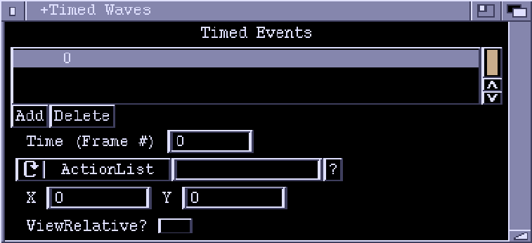

# TimedAttackWaves Window

This window lets you edit a TimedAttackWaves chunk. Basically, this is just a
list of events set up to occur at specific times.

**Timed Events**  
A list of events, sorted by time values.

**Add**  
Add a new event.

**Delete**  
Delete the highlighted event.

**Time**  
The time value of the event. This is given as a frame number. For a full
framerate game there are 50 frames per second for PAL machines, and 60 frames
per second on NTSC. Half framerate games run at 25 (PAL) or 30 frames per
second (NTSC). If a new value is entered here, the event will be moved to the
appropriate place in the list.

**ActionList/InitBadDude/Formation**  
The cycle gadget determines the type of the event. For 'ActionList' events
the string gadget holds the name of the ActionList to execute (it will be
executed in a global context). For 'InitBadDude' events, a new BadDude object
will be created at the given position (see below) and the specified ActionList
will be executed upon it. 'Formation' events start a Formation at the given
position.

**X, Y**  
X,Y coordinates of event, if it is of 'InitBadDude' or 'Formation' type.  
These values have no meaning for 'ActionList' events.

**ViewRelative**  
If this checkbox is ticked, then X and Y are taken as offsets from the current
position of the view (view relative coordinates).  
If clear, the X,Y position is taken as relative to the background map
(absolute coordinates).

