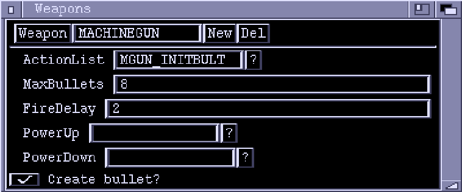
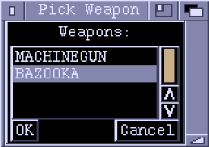

# Weapons Window

**Weapon**  
The name of the Weapon currently being edited. Clicking the button lets you
select another weapon to edit using a requester.  
  
 The string gadget lets you edit the name of the selected weapon.

**New**  4
Creates a new weapon.

**Del**  
Deletes the current weapon.

**ActionList**  
The ActionList executed when the weapon is fired. This ActionList can be
executed either upon the player object firing the weapon, or on a newly created
PlayerBullet object, depending on the "Create Bullet?" checkbox (see below).  
You can type an ActionList name directly into the string gadget or pick one
from a loaded chunk using the "?" button.

**MaxBullets**  
This is the maximum number of PlayerBullet objects originating from this
weapon that can exist at any one time. Any subsequent attempts to fire the
weapon will be ignored.

**FireDelay**  
This is the number of frames to wait between each firing of the weapon.
Any attempts to fire the weapon before this time delay has expired will be
ignored.

**PowerUp**  
Specifies the PowerUp weapon for the currently selected weapon. When a weapon
bay is powered up (using the 'PowerUp' Action), the weapon it contains is
replaced by its PowerUp weapon. If you leave this field blank, then powering up
will have no effect.

**PowerDown**  
Specifies the PowerDown weapon for the currently selected weapon.

**Create Bullet?**  
If this checkbox is **clear**, then the ActionList specified in the "ActionList"
field is executed on the **Player** object that fired the weapon.  
If this is **ticked**, then when the weapon fires a new PlayerBullet object will be created
and "ActionList" executed upon the **PlayerBullet**.
